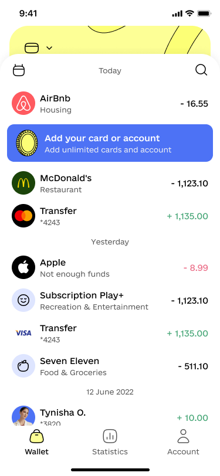
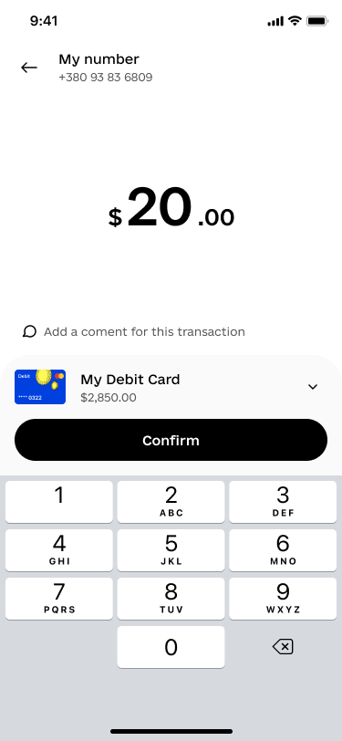
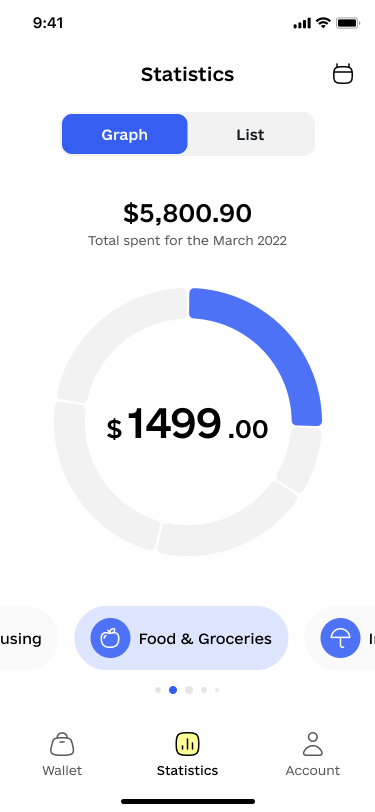

# Coinstar - Finance Mobile App


Welcome to **Coinstar**, a finance mobile app designed to help users manage their finances effectively. This project is based on the Coinstar Finance Mobile App UI Kit, featuring a sleek and modern design.

## 🚀 Demo & Design

For a preview of the app design, please refer to the [Figma Design](https://www.figma.com/design/KEDcxW9t9UIAEYKkXZbKKL/Coinstar---Finance-Mobile-App-UI-Kit-(Community)?node-id=1020-89887&t=INEmeiBw912hoK0m-1). This design serves as the UI/UX reference for the app's development.

### 📱 App Screenshots

| Home Screen | Transaction List |
|-------------|------------------|
|  |  |

| Add Expense | Analytics | Notifications |
|-------------|-----------|---------------|
|  |  |  |

*Screenshots are placeholders. Replace the paths with actual images from your app.*

## 📋 Table of Contents

- [Features](#features)
- [Installation](#installation)
- [Tech Stack](#tech-stack)
- [Project Structure](#project-structure)
- [Usage](#usage)
- [Contributing](#contributing)
- [License](#license)

## ✨ Features

- 📊 **Real-time Financial Data**: View and track your financial status easily.
- 💳 **Expense Management**: Add, edit, and categorize expenses.
- 🔔 **Notifications**: Receive timely reminders and alerts about financial activities.
- 📈 **Graphs & Analytics**: Visualize your spending with dynamic charts and graphs.

## 🛠 Tech Stack

- **React Native** - Cross-platform mobile app development
- **Redux** - State management
- **TypeScript** - Strongly typed programming language for JavaScript
- **React Navigation** - App navigation
- **Axios** - API requests
- **Stylesheets ** - For styling the app

## 📦 Installation

### Prerequisites

Make sure you have the following installed:
- [Node.js](https://nodejs.org/)
- [Yarn](https://yarnpkg.com/) or [npm](https://www.npmjs.com/)

### Steps

1. Clone the repository:

    ```bash
    git clone https://github.com/yourusername/coinstar-app.git
    cd coinstar-app
    ```

2. Install dependencies:

    ```bash
    yarn install
    # or
    npm install
    ```

3. Start the app:

    ```bash
    yarn start
    # or
    npm start
    ```

4. Run on Android or iOS:

    ```bash
    yarn android
    yarn ios
    ```

## 🏗 Project Structure

```plaintext
coinstar-app/
│
├── src/                       # Main source code
│   ├── components/            # Reusable components
│   ├── screens/               # App screens
│   ├── navigation/            # Navigation setup
│   ├── assets/                # Images, fonts, etc.
│   ├── services/              # API services
│   ├── store/                 # Redux store and slices
│   └── utils/                 # Utility functions
│
├── App.tsx                    # Root component
├── package.json               # Project configuration
└── README.md                  # Project README file
