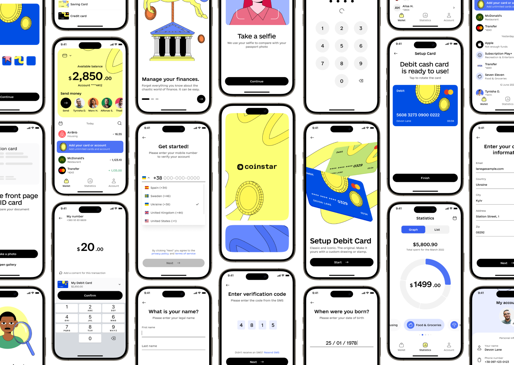

# Coinstar - Finance Mobile App


Welcome to **Coinstar**, a finance mobile app designed to help users manage their finances effectively. This project is based on the Coinstar Finance Mobile App UI Kit, featuring a sleek and modern design.

## 🚀 Demo & Design

For a preview of the app design, please refer to the [Figma Design](<https://www.figma.com/design/KEDcxW9t9UIAEYKkXZbKKL/Coinstar---Finance-Mobile-App-UI-Kit-(Community)?node-id=1020-89887&t=INEmeiBw912hoK0m-1>). This design serves as the UI/UX reference for the app's development.

## Screenshots

<div style="display: flex; flex-direction: 'row';">


</div>

### 📱 App Screenshots

<div style="display: flex; flex-direction: 'row';">


</div>


## 📋 Table of Contents

- [Features](#features)
- [Installation](#installation)
- [Tech Stack](#tech-stack)
- [Project Structure](#project-structure)
- [Usage](#usage)
- [Contributing](#contributing)
- [License](#license)

## ✨ Features

- 📊 **Real-time Financial Data**: View and track your financial status easily.
- 💳 **Expense Management**: Add, edit, and categorize expenses.
- 🔔 **Notifications**: Receive timely reminders and alerts about financial activities.
- 📈 **Graphs & Analytics**: Visualize your spending with dynamic charts and graphs.

## 🛠 Tech Stack

- **React Native** - Cross-platform mobile app development
- **Redux** - State management
- **TypeScript** - Strongly typed programming language for JavaScript
- **React Navigation** - App navigation
- **Axios** - API requests
- **Stylesheets ** - For styling the app

## 📦 Installation

### Prerequisites

Make sure you have the following installed:

- [Node.js](https://nodejs.org/)
- [Yarn](https://yarnpkg.com/) or [npm](https://www.npmjs.com/)

### Steps

1. Clone the repository:

   ```bash
   git clone https://github.com/repo-bilalnaeem/Coinstar.git
   cd Coinstar
   ```

2. Install dependencies:

   ```bash
   yarn install
   # or
   npm install
   ```

3. Start the app:

   ```bash
   yarn start
   # or
   npm start
   ```

4. Run on Android or iOS:

   ```bash
   yarn android
   yarn ios
   ```

## 🏗 Project Structure

```plaintext
Coinstar/
│
├── app/                       # Main source code
│   ├── (authenticated)/       # Authenticated screens
│   └── (identification)/      # Signup components
│
├── assets/                    # Images, fonts, etc.
├── components/                # Reusable components
├── constants/                 # Resuable stylesheets
├── ios/                       # IOS build folder
├── screenshots/               # App screenshots
├── store/                     # Redux store and slices
├── utils/                     # Utility functions
├── package.json               # Project configuration
└── README.md                  # Project README file
```
